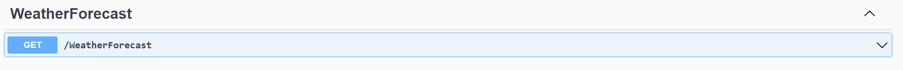
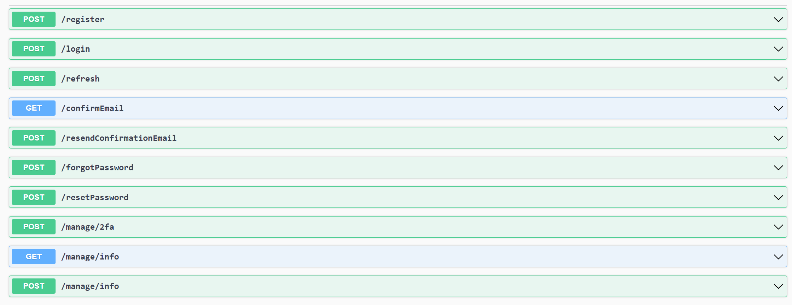

# KATA Tuto

Le but de ce Kata est d'évaluer la capacité du candidat à :
- suivre et reproduire un tutoriel
- travailler avec le gestionnaire de code git
- utiliser le gestionnaire de package nuget

Dans ce Kata, vous allez :
- Créer une API REST (Application Programming Interface)
- Ajouter les endpoints nécessaires pour sécuriser une application web
- Sécuriser votre API

La durée estimée de ce Kata est de moins de 30minutes (hormis le temps d'installation de votre environnement de dévéloppement)

## Prérequis

- Un éditeur de code (Je recommande `Visual Studio` dont la community Edition est gratuite). 
Vous pouvez aussi utuliser `VS Code` (avec .net CLI), `Rider` ou tout autre IDE de votre choix.
- dotnet SDK (.Net 8). L'installer de Visual Studio vous permet d'installer .net sdk plus facilement
- un client git est installé sur votre machine

## 1. Créer un nouveau projet

### 1.1 Comment créer un nouveau projet avec `Visual Studio`

- Dans le menu Fichier, sélectionnez Nouveau > Projet.
- Entrez **Web API** dans la zone de recherche.
- Sélectionnez le modèle **ASP.NET Core Web API**  et sélectionnez Suivant.
- Dans la boîte de dialogue Configurer votre nouveau projet, nommez le projet KataTuto et sélectionnez Suivant.
- Dans la boîte de dialogue Informations supplémentaires :
    - Confirmez que le Framework est **.NET 8.0 (Long Term Support)**.
    - Confirmez que la case à cocher **Use controllers(uncheck to use minimal APIs)** est cochée.
    - Confirmez que la case à cocher **Enable OpenAPI support** est cochée.
    - Sélectionnez Créer.
- Lancez le projet
- Votre navigateur s'ouvrira avec le l'exemple d'API par défaut WeatherForcast qui contient déjà plusieurs endpoints:

    

- Essayer d'exécuter l'API 

### 1.2 Comment créer un nouveau projet avec `Visual Studio Code`
- Ouvrir le terminal
- Aller au repertoire qui contiendra votre projet
- Lancer les commandes suivantes

```bash
dotnet new webapi --use-controllers -o KataTuto
code -r KataTuto
```

## 2. Ajouter les packages
Installez les packages nuget suivants:
- Microsoft.AspNetCore.Identity.EntityFrameworkCore
- Microsoft.EntityFrameworkCore.InMemory

[Comment ajouter un package nuget avec Visual Studio](https://learn.microsoft.com/en-us/nuget/quickstart/install-and-use-a-package-in-visual-studio)

Comment ajouter un package nuget en ligne de commande
```
dotnet add package Microsoft.AspNetCore.Identity.EntityFrameworkCore
dotnet add package Microsoft.EntityFrameworkCore.InMemory
```

## 3. Modifier le code
1. Créer le fichier `KataDbContext.cs` qui hérite de `DbContext`
```cs
using Microsoft.AspNetCore.Identity;
using Microsoft.AspNetCore.Identity.EntityFrameworkCore;
using Microsoft.EntityFrameworkCore;

public class KataDbContext : IdentityDbContext<IdentityUser>
{
    public KataDbContext(DbContextOptions<KataDbContext> options)
        : base(options)
    {

    }
}
```

2. Dans `Program.cs` ajouter les lignes de code suivantes

```cs
builder.Services.AddDbContext<KataDbContext>(opt =>
    opt.UseInMemoryDatabase("KataTuto"));
builder.Services.AddAuthorization();
builder.Services.AddIdentityApiEndpoints<IdentityUser>()
    .AddEntityFrameworkStores<KataDbContext>();
```
...

```cs
app.UseAuthorization();
app.MapIdentityApi<IdentityUser>();
```
## 4. Lancer l'appli et testez

Les endpoints de Identity sont maintenant visibles.
 


## 5. Securisez votre API
Ajouter l'attribut `[Authorize]` la methode `Get` dans `WeatherForecastController.cs`
Puis vérifiez que GetWeatherForecast ne peut plus être invoqué sans être authentifié.

```cs
using Microsoft.AspNetCore.Authorization;
using Microsoft.AspNetCore.Mvc;

[ApiController]
[Route("[controller]")]
public class WeatherForecastController : ControllerBase
{
    [Authorize]
    [HttpGet(Name = "GetWeatherForecast")]
    public IEnumerable<WeatherForecast> Get()
    {
        // ...
    }
}
```
## 5. Publier votre projet
Publiez votre projet sur github ou bitbucket et partagez le lien
1. Connectez vous à github.com puis créez un repo vide git que vous nomerz `kata-repo`. Vous aurez besoin de l'URL plus tard

2. Initialiser un nouveau repo Git
```bash
git init
```

3. Add all files to the repository
```bash
git add .
```

4. Commit the changes
```bash
git commit -m "Initial commit"
```

5. Ajouter le repository distant
```
git remote add origin <kata-repo_url>
```

6. Pushez votre code
```
git push -u origin master
```